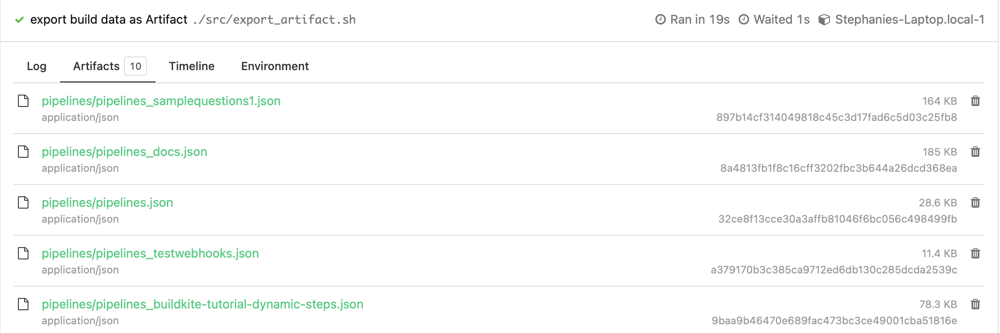

# Export-Build-Example
A pipeline template example to export builds via the API, stores the results as JSON file

This repository is an example [Buildkite](https://buildkite.com/) pipeline for running scripts to get build data exported  to S3 Bucket, Artifact, or to the Local Machine 

The scripts in the src/ folder, can be used for:
* Get Files Locally: /src/export.sh
* Upload to S3 Bucket: /src/export_s3.sh
* Upload as Artifact: /src/export_artifact.sh

Note: $TOKEN is the [User API Access Token](https://buildkite.com/user/api-access-tokens). It can be set in the environment hook in .git/hooks/environment or using any methods in [managing pipeline secrets](https://buildkite.com/docs/pipelines/secrets#main)

## Examples
### Get Files Locally
This example is used to export the build data for all pipelines to the local machine. 

```yml
steps:
  - label: "export build data to Local Machine"
    command: ./src/export.sh
```
The files can be accessed on the local machine from the Builds directory ../buildkite-agent/builds. The respective pipeline folder contains the JSON files for each pipeline in the organization

### Get Files as Artifact
To export the build data for all pipelines as an artifact. The Artifacts can be viewed and also downloaded
```yml
steps:
  - label: "export build data as Artifact"
    command: ./src/export_artifact.sh
```
:warning: Warning: These files are stored in Buildkite's S3 Bucket, which will only be available for 6 months and has a max file size of 5GB per file. <br/>

#### Artifact in UI


:lantern: Note: If you need permanent storage for the build data in your Private S3 Bucket. Follow [Using your own private AWS S3 Bucket](https://buildkite.com/docs/agent/v3/cli-artifact#using-your-private-aws-s3-bucket)


## Adding Filters
### Timestamp Filter
To use the Timestamp Filter, you need to edit the build_url variable for the script in the src/ folder. The two attributes [created_from](https://buildkite.com/docs/apis/rest-api/builds#list-all-builds) & [created_to](https://buildkite.com/docs/apis/rest-api/builds#list-all-builds) are used to specify the date range and time. In script

### Examples

This example filters based on the created_from & created_to attributes this gives a range: 

Using Optional query parameter ?created_from= & created_to=

```bash
# This returns all builds created on or after 25th March 2022 and before 28th March 2022
   build_url="https://api.buildkite.com/v2/organizations/{org.slug}/pipelines/{pipeline.slug}/builds?created_from=2022-03-25&created_to=2022-03-28" 
```

### Build State Filter
Filters the results by the given build state, you need to edit the build_url variable for the script in the src/ folder. Check Buildkite [Build State](https://buildkite.com/docs/pipelines/defining-steps#build-states) for all the build state information

### Examples
This example filters based on the state of the build. The query below returns all builds in the pipeline that passed:

Using Optional query parameter ?state=

```bash
# This returns all passed builds
    build_url="https://api.buildkite.com/v2/organizations/$BUILDKITE_ORGANIZATION_SLUG/pipelines/$slug/builds?state=passed"
```

### Using Timestamp and Build State Filters
Filters the results by the given build state as well as the timeline.  You need to edit the build_url variable for the script in the src/ folder.

### Examples
This example filters based on the timestamp range as well as build state:

Using Optional query parameter ?state= & created_from= & created_to

```bash
# This returns all builds that passed within the time range and also passed
    build_url="https://api.buildkite.com/v2/organizations/{org.slug}/pipelines/{pipeline.slug}/builds?state=passed&created_from=2022-03-25&created_to=2022-03-28"
```

## License

See [License.md](License.md) (MIT)


