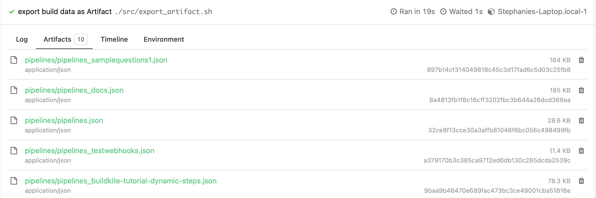

# Export-Build-Example
A pipeline template example to export builds via the API, stores the results as JSON file

This repository is an example [Buildkite](https://buildkite.com/) pipeline for running scripts to get build data exported  to S3 Bucket, Artifact, or to the Local Machine 

Note: $TOKEN is the [User API Access Token](https://buildkite.com/user/api-access-tokens). It can be set in the environment hook in .git/hooks/environment or using any methods in [managing pipeline secrets](https://buildkite.com/docs/pipelines/secrets#main)


## Adding Filters
Usage ./src/export.sh -p <pipeline_slug> -s <build_state> -f <created_from> -t <created_to>"

| Flag Options  |  Usage      
| ------------- | ------------- 
| ` -p `        | Filter by pipeline_slug       
| ` -s `        | Filter by Build State   
| ` -f `        | Filter by Date/Time using API Parameter created_to     
| ` -t `        | Filter by Date/Time using API Parameter created_to    
| ` -e `        | Export as Artifact/S3   
       
* The two attributes [created_from](https://buildkite.com/docs/apis/rest-api/builds#list-all-builds) & [created_to](https://buildkite.com/docs/apis/rest-api/builds#list-all-builds) are used to specify the date range and time
* Check Buildkite Valid [Build States](https://buildkite.com/docs/pipelines/defining-steps#build-states)

## Examples
### Get Files Locally
This example is used to export the passed builds data for all pipelines to the local machine, for a certain timeline

Format:
```
./src/export.sh -s <build_state> -f <created_from> -t <created_to>"
```

#### **`pipeline.yml`**
```yml
steps:
  - label: "export build data to Local Machine"
    command: ./src/export.sh -s passed -f 2023-03-25 -t 2023-03-28
```
The files can be accessed on the local machine from the Builds directory ../buildkite-agent/builds. The respective pipeline folder contains the JSON files for each pipeline in the organization

### Get Files as Artifact
In this example, the build data for a pipeline and is exported as an Artifact. The Artifact can be viewed and also downloaded. 

**Note:** You need to use flag **"-e"**, and the value must be "**artifact**"

Format:

```
./src/export.sh -p <pipeline_slug> -s <build_state> -f <created_from> -t <created_to>" -e artifact
```

#### **`pipeline.yml`**
```yml
steps:
  - label: "export build data as Artifact"
    command: ./src/export.sh -p pipeline_slug -s passed -f 2023-03-25 -t 2023-03-28 -e artifact
```

  
:warning: Warning: These files are stored in Buildkite's S3 Bucket, which will only be available for 6 months and has a max file size of 5GB per file. <br/>

#### Artifact in UI


:lantern: Note: If you need permanent storage for the build data in your Private S3 Bucket. Doing this will store all subsequent artifacts to the bucket. Follow [Using your own private AWS S3 Bucket](https://buildkite.com/docs/agent/v3/cli-artifact#using-your-private-aws-s3-bucket).


### Upload Files to S3 Bucket
In this example, the build data for a pipeline is exported to the User's S3 Bucket.

**Note:** You need to use flag **"-e"**, and the value must be "**bucket**"

Format:

```
./src/export.sh -p <pipeline_slug> -s <build_state> -f <created_from> -t <created_to>" -e bucket
```

#### **`pipeline.yml`**
```yml
steps:
  - label: "export build data as Artifact"
    command: ./src/export.sh -p pipeline_slug -s passed -f 2023-03-25 -t 2023-03-28 -e bucket
```

#### Requirement
* Declare private s3 bucket name $my_bucket_name
* awscli 
* s3 bucket


## License

See [License.md](License.md) (MIT)


